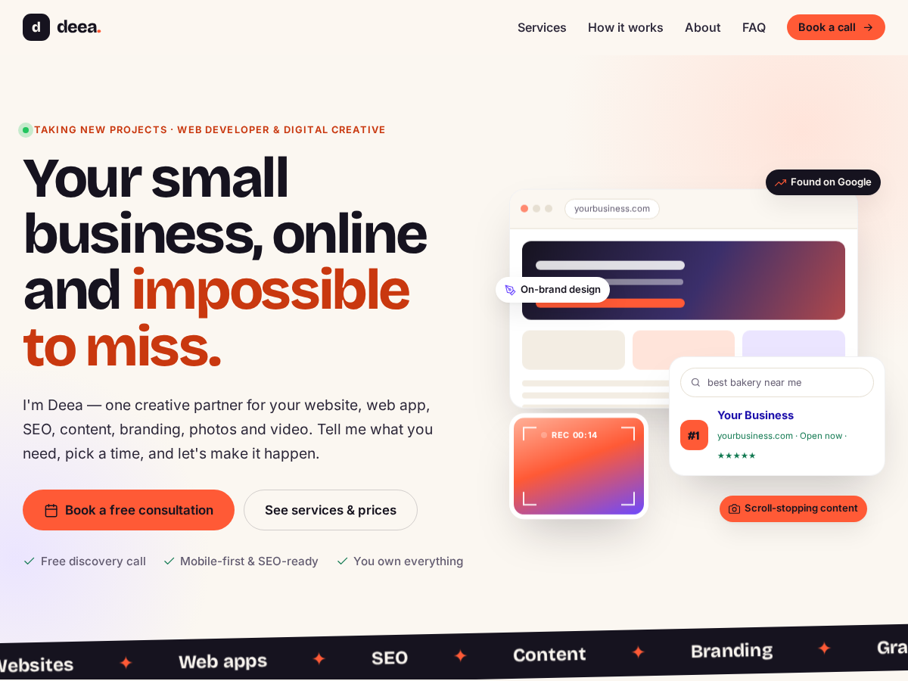

# Deea Creative: WordPress theme

The same design as the booking app's landing page, as a WordPress theme, so you can edit text, services and prices,
and write a blog, from the WordPress dashboard.



## Install

**Easiest:** in WordPress go to **Appearance → Themes → Add New → Upload Theme**, choose **`deea.zip`**, then **Activate**.

**Or** copy the `deea` folder into `wp-content/themes/`
(XAMPP: `C:\xampp\htdocs\wordpress\wp-content\themes\deea`).

## Set it up (5 minutes)

1. **Services:** activating the theme creates 8 starter services (Website, Web App, SEO, Content, Graphic Design,
   Photography, Videography, Small Business Launch Pack). Edit prices, taglines, icons and order in **WP Admin → Services**.
   The service with booking slug `launch-pack` is shown as the dark "For small businesses" offer section.
2. **Your details:** go to **Appearance → Customize → Deea: Business details** and set:
   - your name, title, email, phone and location,
   - the hero headline and about text,
   - the **Booking page URL**, which every "Book" button uses. On XAMPP the default `/booking-app/book.php` already works
     if the booking app is in `htdocs/booking-app`. Live, use e.g. `https://book.yourdomain.com/book.php`,
   - the price format (`€%s`, `%s lei`, `$%s`…) and social profile links.
3. **Menus (optional):** without a menu, the header links to Services, How it works, About and FAQ automatically.
   Create a menu under **Appearance → Menus** and assign it to *Main menu* or *Footer menu* to customize it.
4. **Blog (optional):** posts appear as a "Latest from the studio" section on the homepage. For a full blog page,
   create an empty page called "Blog" and pick it as the *Posts page* in **Settings → Reading**.
5. **Privacy:** set your privacy policy page in **Settings → Privacy** and it's linked in the footer.

## How the WordPress site and the booking app fit together

```
yourdomain.com            → WordPress + this theme (landing page, blog)
book.yourdomain.com       → booking-app (booking calendar, client links, admin)
        ▲
        └── every "Book" button links here, with ?service=… pre-selected
```

On XAMPP: `http://localhost/wordpress/` (WordPress) and `http://localhost/booking-app/` (booking app).

Tested with WordPress 6.8 and PHP 8.4, with `WP_DEBUG` on and no notices from the theme.
